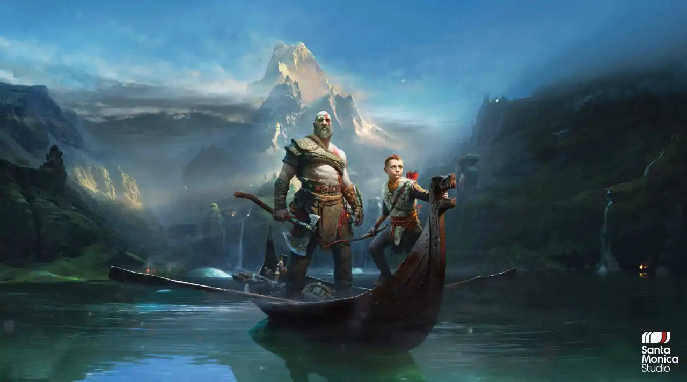

# 你好
This is the my first Assignment
## About me
I'm a Bachelor of Arts at [University of Auckland](https://unidirectory.auckland.ac.nz/profile/a-fergusson). (majoring in Mathematics,Statsics)
### I love vedio games, Playstation is the Best!!!
[God Of War]is my favorite IP

I made using the R package [{magick}](https://cran.r-project.org/web/packages/magick/vignettes/intro.html).

```
library(magick)

#picture 1
MakkaPakka <- image_read("https://bkimg.cdn.bcebos.com/pic/503d269759ee3d6d428abc924c166d224f4ade1e?x-bce-process=image/crop,x_231,y_0,w_476,h_671/resize,m_lfit,w_552,limit_1/quality,Q_70/format,f_auto")%>%
  image_scale(200)

#picture 2
UpsyDaisy <- image_read("https://bkimg.cdn.bcebos.com/pic/0dd7912397dda144e20e57ebbdb7d0a20cf48667?x-bce-process=image/crop,x_76,y_0,w_212,h_300/resize,m_lfit,w_552,limit_1/quality,Q_70/format,f_auto")%>%
  image_scale(200)

ING_vector <- c(MakkaPakka, UpsyDaisy)

image_append(ING_vector, stack = TRUE)

Blank
black_square <- image_blank(width = 200, 
                           height = 282, 
                           color = "#21415e") %>%
  image_annotate(text = "Good night,\nTime to Go to Sleep",
                 color = "#FFFFFF",
                 size = 20,
                 font = "Impact",
                 gravity = "east")
black_square

ING_vector <- c(MakkaPakka, UpsyDaisy)

image_append(ING_vector, stack = TRUE)

#put square on the rightside
first_row <- c(ING_vector, black_square)%>%
  image_append()
first_row
image_write(first_row, "meme.png")
```

